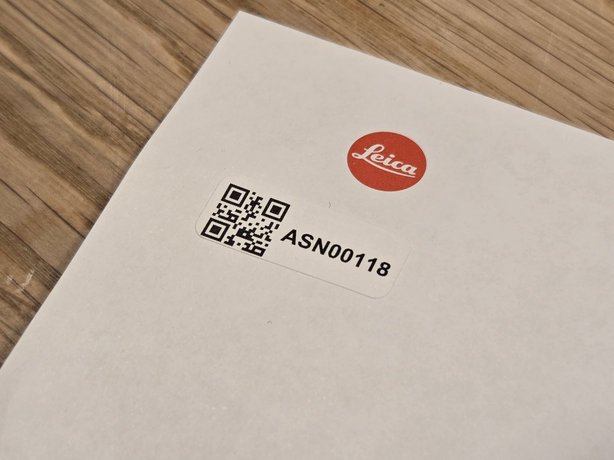
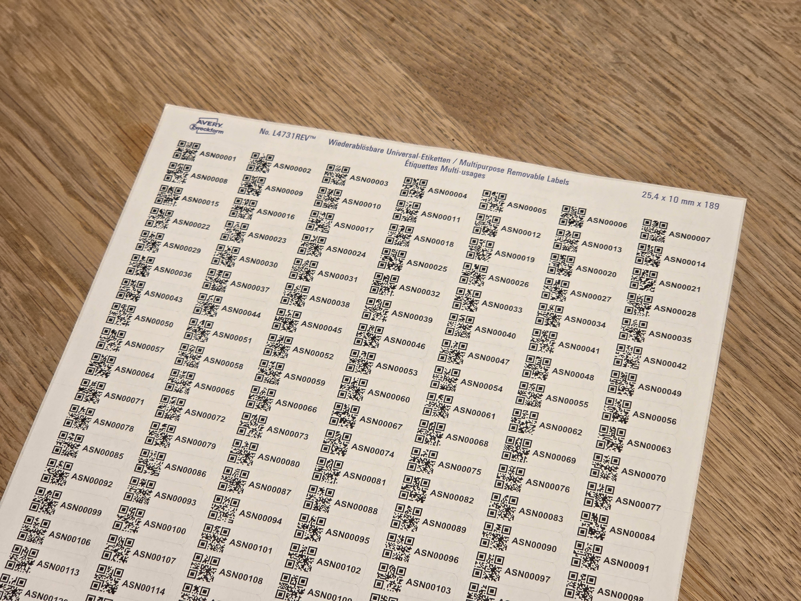

# ASN QR Sticker Generator

A Python script to generate QR code labels for ASN (Archive Serial Number, e.g. for paperless-ngx). Creates PDF files with customizable label layouts for printing on sticker sheets.

## Features

- Predefined label templates (e.g., Avery L4731REV-25)
- Custom layout configuration
- QR code generation with text labels
- PDF output optimized for printing
- Support for various page sizes (A4, Letter)
- Advanced options for printer alignment and scaling

## Requirements

- Python 3.6 or higher
- pip (Python package installer)

## Installation

### 1. Download the Script

Download `asn-qr-generator.py` from this repository.

### 2. Install Python

If you don't have Python installed:

1. Go to [python.org](https://www.python.org/downloads/)
2. Download and install Python 3.x
3. Make sure to check "Add Python to PATH" during installation

### 3. Install Dependencies

Open Command Prompt (CMD) in the folder containing the script. You can do this in one of these ways:

- Open the folder in File Explorer, right-click in an empty space, and select "Open in Terminal"
- Or press Win + R, type `cmd`, and press Enter, then navigate to the folder:

```cmd
cd path\to\your\script\folder
```

If pip is not installed (it usually comes with Python 3.4+), install it first:

```cmd
python -m ensurepip --upgrade
```

Then install the required packages:

```cmd
pip install reportlab qrcode[pil] pillow
```

**Note:** If `python` doesn't work in any command, try `py` instead (e.g., `py -m ensurepip --upgrade`).

## Usage

### Running the Script

Open Command Prompt in the script directory using one of the methods described in the Installation section above.

Then run the script:

```cmd
python asn-qr-generator.py
```

**Note:** If `python` doesn't work, try `py asn-qr-generator.py` instead. The `py` launcher is sometimes used on Windows systems.

### Interactive Setup

The script will guide you through the setup process:

1. **Select Template**: Choose from predefined templates or create a custom layout
2. **Configure Layout**: If custom, enter page size, margins, grid settings, etc.
3. **Code Settings**: Specify prefix, starting number, leading zeros
4. **Output Settings**: Set number of pages and output filename
5. **Advanced Options** (optional): Debug frames, offset, scaling
6. **Confirmation**: Review settings and generate PDF

### Example Output

The script generates a PDF file with QR codes arranged on labels according to your specifications. Each QR code contains encoded information (e.g., ASN numbers) suitable for paperless scanning systems.

## Images




## Templates

Currently supported templates:
- Avery L4731REV-25 (A4) - 27 rows × 7 columns

Custom layouts allow full control over:
- Page size and orientation
- Margins and gaps
- Grid dimensions
- Dead zones

## Dependencies

- `reportlab`: PDF generation
- `qrcode[pil]`: QR code creation
- `pillow`: Image processing

## Troubleshooting

- Ensure all dependencies are installed
- Check that Python is in your PATH
- For printing issues, verify PDF settings in your viewer

## Contributing

Help wanted! This script could benefit from more predefined label templates. If you have specifications for other label brands or sizes, please contribute by:

1. Testing the custom layout feature with your labels
2. Submitting pull requests to add new templates to the `TEMPLATES` list
3. Sharing template specifications (page size, margins, grid layout, etc.)

See the `TEMPLATES` variable in the code for the required format. Accurate measurements are crucial for proper printing alignment.

## License

See [LICENSE.txt](LICENSE.txt) for details.

---

*This project was created with the assistance of AI tools.*